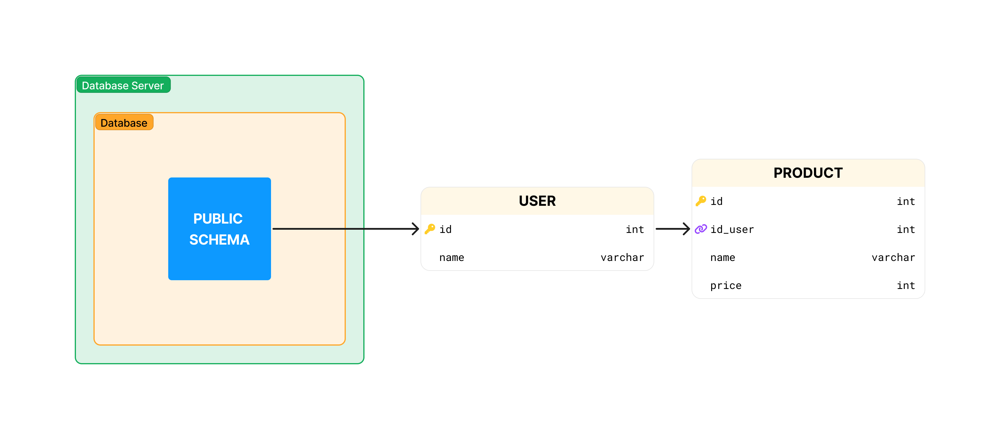
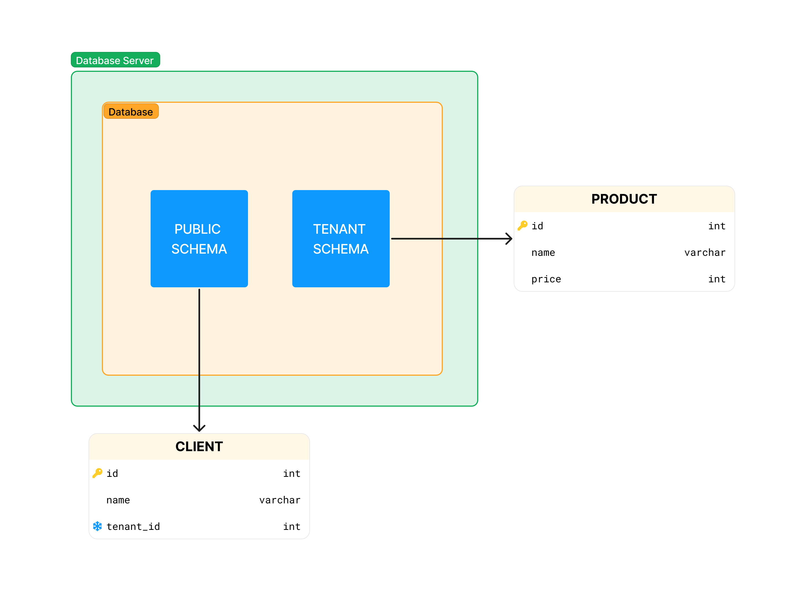
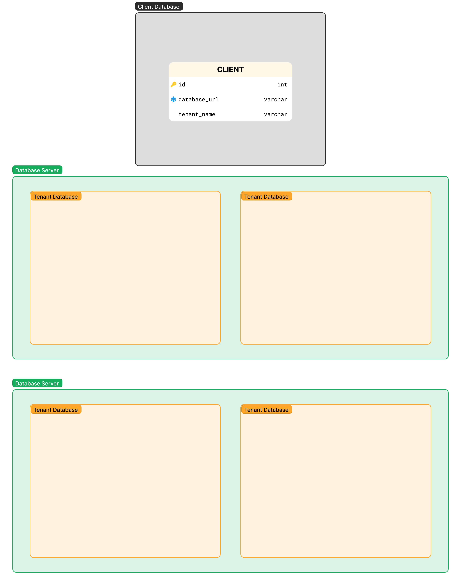

Multitenant architecture is a software design pattern in which a single instance of software serves multiple clients. Each client is a "tenant" in the cloud, and each tenant has its own isolated information. Multitenant architecture is a way to share resources and costs in the cloud, and it is a way to ensure that cloud resources are used efficiently.

So we have different ways to implement this architecture, let's start with a simple example of how it can be implemented, in this case we will use as an example a relational database like `PostgreSQL`.

## A single database for all clients and the same schema

In this example we will have a database server with one database for all clients, and it would look like this:

In this case we have a customer table and a product table, the customer table allows us to identify which customer each product belongs to, so we can separate the information of each customer. All this within the same database and the same `schema`.

This way is the easiest to implement, but it has some problems:

- A bad security implementation could allow one client to see another client's information.
- If one client has a large amount of information, it could affect the performance of the other clients.
- If it makes it difficult to migrate information from one client to another server.

## One single database for all clients and different schemas

In this example we will have a database server with one database for all clients, but each client will have its own schema, and it would look like this:

The public schema is the default schema where we can store general information, such as the name of the client schema to identify the client, payment plan, etc. We can have as many `TENANT SCHEMA` as we have clients.

This form is a bit more complex, but it allows us to have a better separation of the information of each client, and allows us to have a better control of the security.

It also has an improvement with respect to the previous one, since it would be easier to migrate the information from one client to another server. If it were to grow a lot. But we still have the problems of performance and security.

## One database for each customer

In this example we will have a database server with a database for each customer, and it would look like this:

In this case we will have to have a general database registering the url or address of each client's database, in order to identify which database each client belongs to. And (x) database server(s), hosting the databases of each client.

This way is the most secure, as each client has its own database, and cannot see another client's information. It is also the most scalable, because if a client grows a lot, we can migrate its database to another server.

But it is also the most complex, and the most resource consuming, because each client has its own database, and if we have many clients, we could have many database servers. Which means more maintenance costs.

## Finally

All these ways of implementing the multitenant architecture have their advantages and disadvantages, and the choice of one or the other will depend on the needs of each project.
If you are starting a new project and you don't know which one to choose, I would recommend you to try with the first way, and see if it is enough for your needs and go through each of the ways as your project grows.

> Definitions:
>
> - schema: A set of tables, views, functions, etc.
> - database: Structured data stored in a computer system.
> - database server: Hosts and manages databases.
