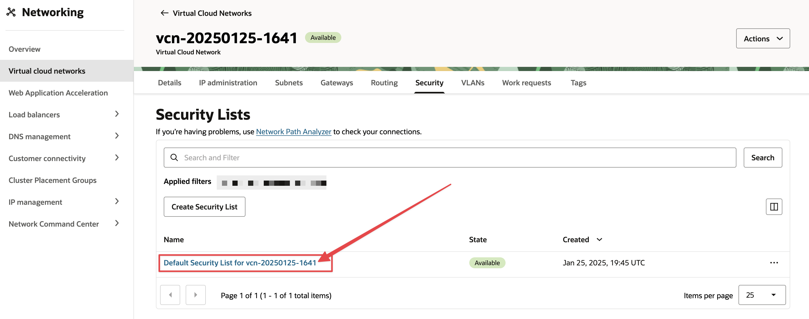
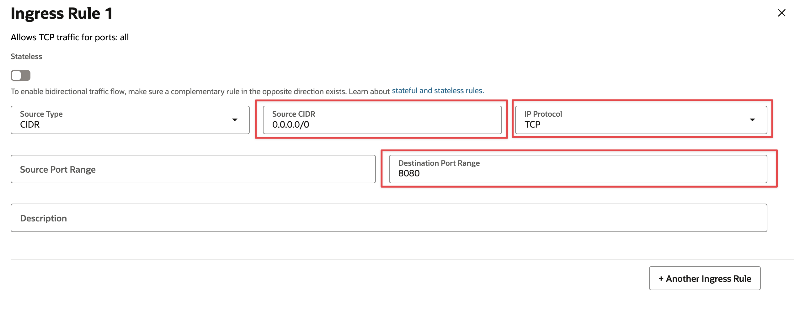

Sin duda alguna, una de las cosas que más se nos dificulta al momento de configurar una instancia de Oracle Cloud es la configuración de los puertos. Es engorroso y no siempre se tiene claro como hacerlo.

> [!NOTE]
> Si estas utilizando UFW, tienes que desactivarlo ya que no es recomendado usarlo en conjunto con Oracle Cloud, ya que puede causar graves problemas.

# Abrir puertos en instancias de Oracle Cloud (WEB)

el primer paso es ir a [Instancias](https://cloud.oracle.com/compute/instances) y seleccionar la instancia que deseas configurar.

nos vamos a la seccion de **Instance details** y seleccionamos el acceso a **Virtual cloud network**


Una vez dentro de la VCN, nos vamos a el tab de **Security** y seleccionamos nuestra Regla de seguridad, en la mayoría de los casos es la regla de seguridad por defecto.



Ahora en **Add Ingress Rules** vamos a agregar la regla de seguridad para el puerto que deseamos abrir. En este caso vamos a abrir el puerto 8080.




Guardamos los cambios y ahora nos conectamos a la instancia mediante SSH.

# Modificar el firewall de la instancia

Una vez dentro de la instancia, vamos a modificar el firewall de la instancia.

```bash
# Agregamos la regla, en este caso el puerto 8080
sudo iptables -A INPUT -p tcp --dport 8080 -j ACCEPT

# Guardamos los cambios
sudo sh -c "iptables-save > /etc/iptables/rules.v4"

# Hacemos persistencia de las reglas
sudo netfilter-persistent save
```

Con esto ya podemos acceder a la instancia desde el puerto 8080, y cualquier otro puerto que deseemos, simplemente cambiando el puerto en la regla por la deseada. 🚀

Referencias:

- [Enabling Network Traffic to Ubuntu Images in Oracle Cloud Infrastructure](https://blogs.oracle.com/developers/post/enabling-network-traffic-to-ubuntu-images-in-oracle-cloud-infrastructure)