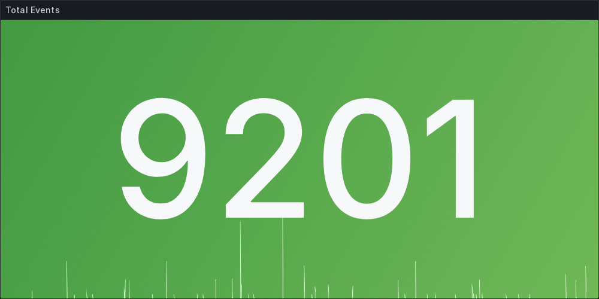

Vamos a ver cómo podemos convertir nuestros dashboards de [Grafana](https://grafana.com/) en imágenes, para poder compartirlos en cualquier lugar, como por ejemplo en slack, discord, microsoft teams, etc.
Con esto podremos tener una vista previa de nuestros dashboards sin necesidad de entrar a Grafana y crear automatizaciones para enviarlas a nuestros equipos.

## Prerrequisitos

> Nota: Necesitamos una instancia de Grafana corriendo, con la versión 8.3.11 o superior. Grafana >=8.3.11

Necesitamos tener instalado el plugin [Grafana Image Renderer](https://grafana.com/grafana/plugins/grafana-image-renderer/) en nuestro Grafana, para poder renderizar nuestros dashboards en imágenes, y para que nos genere los endpoints necesarios para poder hacer las peticiones.

La primera opción es instalar este plugin desde su CLI, mediante el siguiente comando:

```bash
grafana-cli plugins install grafana-image-renderer
```

Otra opción es instalarlo mediante docker, para eso necesitamos agregar la siguiente imagen a nuestro docker-compose:

```yaml title="docker-compose.yml"
version: "2"
services:
  grafana:
    image: grafana/grafana:latest
    ports:
      - ‘3000:3000’
    environment:
    GF_RENDERING_SERVER_URL: http://renderer:8081/render
    GF_RENDERING_CALLBACK_URL: http://grafana:3000/
    GF_LOG_FILTERS: rendering:debug
  renderer:
    image: grafana/grafana-image-renderer:latest
    ports:
      - 8081
```

Para iniciar los servicios, ejecuta:

```
docker-compose up
```

> Nota: Asegúrate de que tienes tu [API Key](https://grafana.com/docs/grafana/latest/administration/api-keys/) de Grafana, para poder hacer las peticiones a la API.

## Uso

### Paso 1: Obtener el UID del dashboard

Lo primero que necesitamos es UID del dashboard que queremos renderizar, para esto vamos a ocupar la API de Grafana.

```bash
curl -H "Authorization: Bearer TU_API_KEY" \
  "https://TU_GRAFANA_URL/api/search?type=dash-db"
```

<br>

```json title="response"
[
    {
        "id": 36,
        "uid": "vmIdaerGu",
        "title": "AWS ALB Cloudwatch Metrics",
        "type": "dash-db",
        "tags": [
            "alb",
            "aws",
            "cloudwatch"
        ],
        ...
    },
    {
        "id": 37,
        "uid": "AWSEc2001",
        "title": "AWS EC2",
        "type": "dash-db",
        "tags": [
            "cloudwatch",
            "monitoringartist"
        ],
       ...
    },
    ...
]
```

Con esto obtendremos una lista de todos los dashboards que tenemos en nuestro Grafana, y podremos ver el UID de cada uno, por lo cual solo nos interesa el nodo `uid` y `title` para saber cuál es el dashboard que queremos renderizar.

### Paso 2: Obtener el detalle del dashboard

Luego necesitamos obtener el detalle de este dashboard, para eso ocupamos el siguiente comando:

```bash
curl -H "Authorization: Bearer TU_API_KEY" \
  "https://TU_GRAFANA_URL/api/dashboards/uid/UID_DEL_DASHBOARD"
```

<br>

```json title="response"
{
  "meta": {
    ...
  },
    "dashboard": {
      ...
      "panels": [
      {
        ...
        "id": 19,
        "title": "Healthy targets"
      },
      {
        ...
        "id": 20,
        "title": "Unhealthy targets"
      },
      ]
    }
}
```

De aquí obtendremos el JSON con toda la información de nuestro dashboard, y sus paneles en el nodo `dashboard.panels`, nos interesa el `id` de cada panel para poder renderizarlo y el `title` para identificarlo.

### Paso 3: Renderizar el panel

Como ultimo paso, necesitamos hacer la petición al endpoint de nuestro Grafana Image Renderer, para eso ocupamos el siguiente comando:

```bash
curl -H "Authorization: Bearer TU_API_KEY" \
  "https://TU_GRAFANA_URL/render/d-solo/UID_DEL_DASHBOARD/graph-panel?orgId=ORG_ID&from=TIMESTAMP_INICIO&to=TIMESTAMP_FIN&panelId=ID_DEL_PANEL&width=1000&height=500&tz=UTC&scale=1" \
  --output imagen_dashboard.png
```

Asegúrate de cambiar los valores de estas variables obligatorias:

- `TU_API_KEY`: con tu API Key de Grafana.
- `TU_GRAFANA_URL`: con la URL de tu Grafana.
- `UID_DEL_DASHBOARD`: con el UID del dashboard que quieres renderizar. (Lo obtuvimos en el primer paso)
- `TIMESTAMP_INICIO`: con el timestamp de inicio de la imagen. (Ejemplo: 1724011204)
- `TIMESTAMP_FIN`: con el timestamp de fin de la imagen. (Ejemplo: 1724011204)
- `ID_DEL_PANEL`: con el ID del panel que quieres renderizar. (Lo obtuvimos en el segundo paso)
- `ORG_ID`: con el ID de tu organización.

> Nota: Puedes cambiar el `width` y `height` para cambiar el tamaño de la imagen. También puedes cambiar el `tz` para cambiar la zona horaria y el `scale` para cambiar la calidad de la imagen.

Esto generará un archivo `imagen_dashboard.png` con la imagen de tu dashboard.



## Extras

He dejado un ejemplo de una librería que hice en `Typescript` para poder hacer esto de una manera más fácil,
Esta librería te proporciona 3 métodos para poder renderizar tus dashboards, que son los 3 pasos que vimos anteriormente.
Tómalo como una guía para poder hacer tus propias automatizaciones.
Puedes ver el código en [este repositorio](https://github.com/ga1az/grafana-render-lib)
