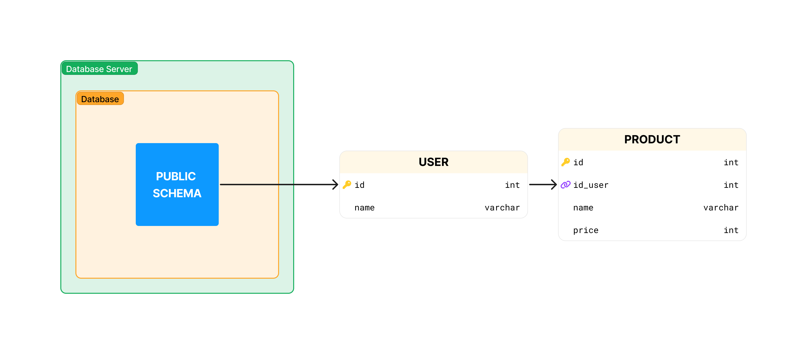
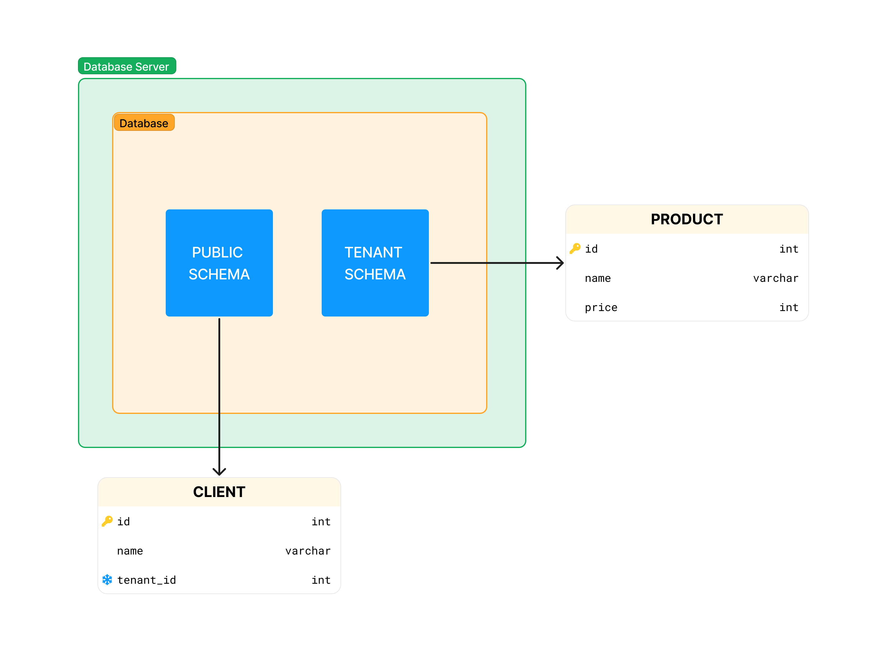
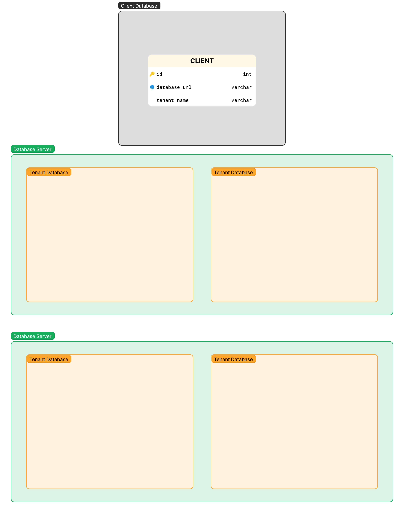

La arquitectura multitenant es un patrón de diseño de software en el que una sola instancia de software sirve a múltiples clientes. Cada cliente es un "inquilino" en la nube, y cada inquilino tiene su propia información aislada. La arquitectura multitenant es una forma de compartir recursos y costos en la nube, y es una forma de garantizar que los recursos de la nube se utilicen de manera eficiente.

Por lo cual tenemos diferentes formas de implementar esta arquitectura, vamos a empezar con un ejemplo sencillo de como se puede implementar, en este caso vamos a usar como ejemplo una base de datos relacional como `PostgreSQL`.

## Una sola base de datos para todos los clientes y mismo schema

En este ejemplo tendremos un servidor de base de datos con una base de datos para todos los clientes, y quedaria de la siguiente manera:

En este caso tenemos una tabla cliente y una producto, la tabla cliente nos permite identificar a que cliente pertenece cada producto, y asi poder separar la informacion de cada cliente. Todo esto dentro de una misma base de datos y un mismo `schema`.

Esta forma es la mas sencilla de implementar, pero tiene algunos problemas:

- Una mala implementacion de la seguridad podria permitir que un cliente pueda ver la informacion de otro cliente.
- Si un cliente tiene una gran cantidad de informacion, podria afectar el rendimiento de los otros clientes.
- Si hace dificil migrar la informacion de un cliente a otro servidor.

## Una sola base de datos para todos los clientes y diferentes schemas

En este ejemplo tendremos un servidor de base de datos con una base de datos para todos los clientes, pero cada cliente tendra su propio schema, y quedaria de la siguiente manera:

El schema public es el schema por defecto aqui podemos guardar informacion general, como el nombre del schema del cliente para poder identificarlo, plan de pago, etc. Podemos tener tantos `TENANT SCHEMA` como clientes tengamos.

Esta forma sube un poco en complejidad, pero nos permite tener una mejor separacion de la informacion de cada cliente, y nos permite tener un mejor control de la seguridad.

Tambien tiene una mejorar con respecto a la anterior, ya que seria mas facil migrar la informacion de un cliente a otro servidor. Si este llegara a crecer mucho. Pero seguimos con los problemas de rendimiento y seguridad.

## Una base de datos para cada cliente

En este ejemplo tendremos un servidor de base de datos con una base de datos para cada cliente, y quedaria de la siguiente manera:

En este caso tendremos que tener una base de datos general registrando la url o direccion de cada base de datos de cada cliente, para poder identificar a que base de datos pertenece cada cliente. Y (x) Servdor(es) de base de datos, alojando las base de datos de cada cliente.

Esta forma es la mas segura, ya que cada cliente tiene su propia base de datos, y no puede ver la informacion de otro cliente. Tambien es la mas escalable, ya que si un cliente crece mucho, podemos migrar su base de datos a otro servidor.

Pero tambien es la mas compleja, y la que mas recursos consume, ya que cada cliente tiene su propia base de datos, y si tenemos muchos clientes, podriamos tener muchos servidores de base de datos. Lo cual significa mas costos de mantenimiento.

## Por ultimo

Todas estas formas de implementar la arquitectura multitenant tienen sus ventajas y desventajas, y la eleccion de una u otra dependera de las necesidades de cada proyecto.
Si estas empezando en un proyecto nuevo y no sabes cual escojer, te recomendaria probar con la primera forma, y ver si es suficiente para tus necesidades y ir pasando por cada una de las formas a medida de que tu proyecto va creciendo.

> Definiciones:
>
> - schema: Es un conjunto de tablas, vistas, funciones, etc.
> - base de datos: Datos estructurados almacenados en un sistema informático.
> - servidor de base de datos: Aloja y gestiona bases de datos.
