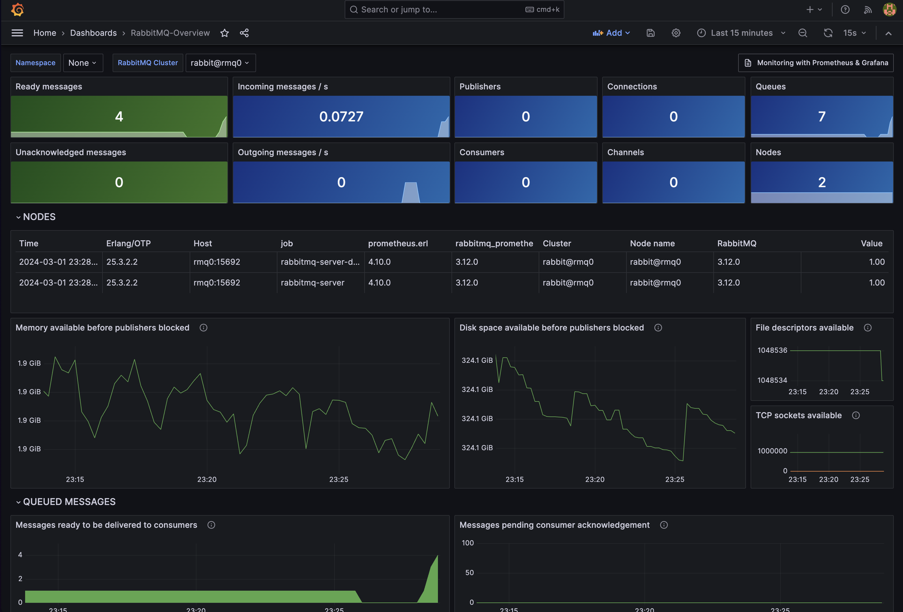
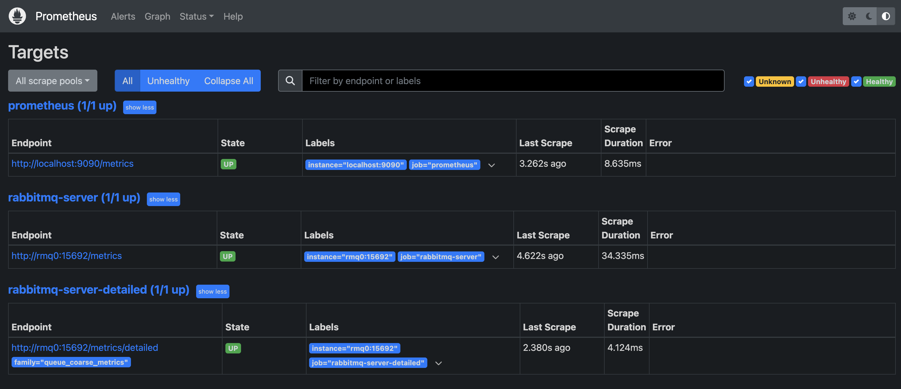

En esta guia mostraremos como configurar nuestro docker-compose para que se ejecute un stack de monitoreo para [RabbitMQ](https://www.rabbitmq.com/) con [Prometheus](https://prometheus.io/) y [Grafana](https://grafana.com/).



Estructura del proyecto:

```bash frame="none"
├── compose.yaml
├── grafana
│   └── dashboards
│       └── rabbitmq-overview.json
│   └── dashboards-provisioning
│       └── dashboards.yml
│   └── datasources
│       └── datasources.yml
├── prometheus
│   └── prometheus.yml
├── rabbitmq
│   └── Dockerfile
└── README.md
```

## Requisitos

Lo primero que necesitamos es tener instalado [Docker](https://docs.docker.com/get-docker/) y [Docker Compose](https://docs.docker.com/compose/install/).

## Configuración

### RabbitMQ

Para configurar RabbitMQ, vamos a crear un Dockerfile que nos permita instalar el plugin de [Prometheus](https://www.rabbitmq.com/prometheus.html) y exponer el puerto 15692.

```bash frame="code" title="/rabbitmq/Dockerfile"
FROM rabbitmq:3.12.0-management
RUN apt-get update && apt-get install -y wget
RUN rabbitmq-plugins enable rabbitmq_management
EXPOSE 5672 15672
CMD ["rabbitmq-server"]
```

### Prometheus

Para configurar Prometheus, vamos a crear un archivo `prometheus.yml` que nos permita configurar el scrape de RabbitMQ.

```yaml frame="code" title="/prometheus/prometheus.yml"
global:
  scrape_interval: 5s

scrape_configs:
  - job_name: "prometheus"
    scrape_interval: 5s
    static_configs:
      - targets: ["localhost:9090"]

  - job_name: "rabbitmq-server"
    static_configs:
      - targets:
          - "rmq0:15692"

  - job_name: "rabbitmq-server-detailed"
    metrics_path: "/metrics/detailed"
    params:
      family: ["queue_coarse_metrics"]
    static_configs:
      - targets:
          - "rmq0:15692"
```

En las configuraciones de `scrape_configs` estamos configurando el scrape de RabbitMQ en el puerto 15692, que es el puerto interno que expone el plugin de Prometheus, en su ruta por defecto `/metrics`.
El static_configs es la lista de targets que vamos a monitorear. En este caso, solo tenemos un target que es `rmq0:15692`, que es el nombre del servicio de RabbitMQ en el archivo `compose.yaml`, el cual tiene por hostname `rmq0`.

### Grafana

En este caso tenemos que configurar nuestros dashboards y datasources. Para ello, vamos a crear una carpeta `grafana` con las siguientes subcarpetas y archivos:

- `dashboards`: En esta carpeta vamos a guardar los dashboards que queremos importar a Grafana. En este caso, vamos a guardar el archivo `rabbitmq-overview.json` que contiene el dashboard de RabbitMQ. Lo puedes encontrar [aquí](https://grafana.com/grafana/dashboards/10991-rabbitmq-overview/).

- `dashboards-provisioning`: En esta carpeta vamos a guardar el archivo `dashboards.yml` que nos permite configurar el provisioning de dashboards en Grafana.

- `datasources`: En esta carpeta vamos a guardar el archivo `datasources.yml` que nos permite configurar el datasource de Prometheus en Grafana.

### Docker Compose

Finalmente, vamos a crear nuestro nucléo de configuración en el archivo `compose.yaml`.

```yaml frame="code" title="compose.yaml"
version: "3"

networks:
  rabbitmq-prometheus:

services:
  prometheus:
    image: prom/prometheus
    container_name: prometheus
    command:
      - "--config.file=/etc/prometheus/prometheus.yml"
    ports:
      - 9090:9090
    networks:
      - "rabbitmq-prometheus"
    restart: unless-stopped
    volumes:
      - ./prometheus:/etc/prometheus
      - prom_data:/prometheus
  grafana:
    image: grafana/grafana
    container_name: grafana
    ports:
      - 3000:3000
    restart: unless-stopped
    networks:
      - "rabbitmq-prometheus"
    environment:
      - GF_SECURITY_ADMIN_USER=admin
      - GF_SECURITY_ADMIN_PASSWORD=grafana
    volumes:
      - ./grafana/datasources:/etc/grafana/provisioning/datasources
      - ./grafana/dashboards-provisioning:/etc/grafana/provisioning/dashboards
      - ./grafana/dashboards:/var/lib/grafana/dashboards
  rabbitmq:
    image: rabbitmq
    container_name: "rabbitmq"
    build:
      context: .
      dockerfile: ./rabbitqm-cluster/Dockerfile
    ports:
      - 15673:15672
      - 15693:15692
    networks:
      - "rabbitmq-prometheus"
    hostname: rabbitmq
    environment:
      RABBITMQ_ERLANG_COOKIE: rabbitmq-prometheus
    volumes:
      - ~/.docker-conf/rabbitmq/data/:/var/lib/rabbitmq/
      - ~/.docker-conf/rabbitmq/log/:/var/log/rabbitmq

volumes:
  prom_data:
```

En este archivo estamos configurando tres servicios:

- `prometheus`: Configuramos el servicio de Prometheus con el archivo `prometheus.yml` y el puerto 9090, conectado a la red `rabbitmq-prometheus`, también configuramos un volumen para guardar los datos de Prometheus.

- `grafana`: Configuramos el servicio de Grafana con el puerto 3000, conectado a la red `rabbitmq-prometheus`, también le decimos las credenciales de administrador y configuramos los volúmenes para el provisioning de dashboards y datasources.

- `rabbitmq`: Configuramos el servicio de RabbitMQ con el Dockerfile que creamos anteriormente, exponemos los puertos 15672 y 15692, conectado a la red `rabbitmq-prometheus`, configuramos el hostname y los volúmenes para guardar los datos y logs de RabbitMQ.

los puertos 15673 y 15693 son los puertos que vamos a usar para acceder a la interfaz de RabbitMQ y los puertos 15693 y 15692 son los puertos que vamos a usar para el scrape de Prometheus.

## Ejecución

Para ejecutar el stack de monitoreo, solo necesitamos ejecutar el siguiente comando:

si tienes la versión docker-compose V1:

```bash
docker-compose up -d
```

si tienes la versión docker-compose V2:

```bash
docker compose up -d
```

> el flag `-d` es para que se ejecute en segundo plano. Si no lo usas, verás los logs de los servicios en la terminal.

Una vez que todos los servicios estén corriendo, podemos acceder a la diferentes interfaces:

- Prometheus: [http://localhost:9090](http://localhost:9090)
- Grafana: [http://localhost:3000](http://localhost:3000)
- RabbitMQ: [http://localhost:15673](http://localhost:15673)
- RabbitMQ Prometheus Metrics: [http://localhost:15693/metrics](http://localhost:15693/metrics)

## Comprobar si Prometheus está scrapeando las métricas de RabbitMQ

Para comprobar si Prometheus está scrapeando las métricas de RabbitMQ, vamos a la interfaz de Prometheus [http://localhost:9090](http://localhost:9090) y ahora nos vamos a la pestaña `Status` y hacemos click en `Targets`.

Ahí vamos a ver que el target `rmq0:15692` está en estado `UP` y que la última vez que se scrapeó fue hace unos segundos.



## Crear una cola en RabbitMQ

una vez entremos a la interfaz de RabbitMQ, y nos logueemos con las credenciales por defecto que son `guest:guest`, vamos a crear una cola para ver como se refleja en los dashboards de Grafana.

Para ello, vamos a la pestaña `Queues` y hacemos click en `Add a new queue`.
como nombre de la cola vamos a poner `test_prometheus` y hacemos click en `Add queue`.

Ahora hacemos click en la cola que acabamos de crear o nos vamos al siguiente link [/test_prometheus](http://localhost:15673/#/queues/%2F/test_prometheus) y vamos a ver que la cola está vacía.

vamos a enviar un mensaje a la cola, para ello, hacemos click en `Publish message` y en el campo `Payload` ponemos el mensaje que queremos enviar, por ejemplo `Hello World!` y hacemos click en `Publish message`.

## Ver los dashboards en Grafana

Ahora vamos a la interfaz de Grafana [http://localhost:3000](http://localhost:3000) y nos logueamos con las credenciales que configuramos en el archivo `compose.yaml` que son `admin:grafana`.

Una vez logueados, vamos a la pestaña `Dashboards`

Ahí vamos a ver que el dashboard `RabbitMQ-Overview` está disponible, hacemos click en él y vamos a ver las métricas de RabbitMQ.

> Si no ves el dashboard, puedes importarlo manualmente. Para ello, haz click en `new` y luego en `import` y pega el siguiente codigo `10991` en la opcion `Find and import dashboards for common applications at grafana.com/dashboards`

ahora podemos ver que en el dashboard de RabbitMQ, en la sección `Queues` está la cola que acabamos de crear y que tiene un mensaje en la cola.

## Conclusión

Llegamos al final de esta extensa guía, que tiene todo lo que necesitas para configurar un stack de monitoreo para RabbitMQ con Prometheus y Grafana.

Si tienes alguna duda, no dudes en dejar un comentario o abrir un issue en este repositorio.

- [Repositorio](https://github.com/ga1az/rabbitmq-prometheus-grafana)
- [Blog](https://ga1az.com/blog/monitoreo-de-rabbit-mq-con-prometheus-y-grafana-usando-docker)
