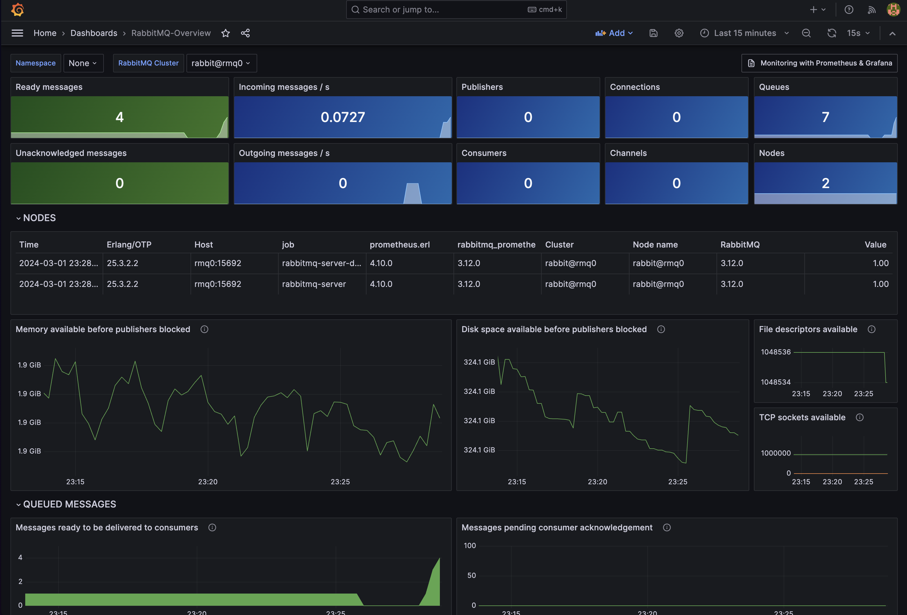
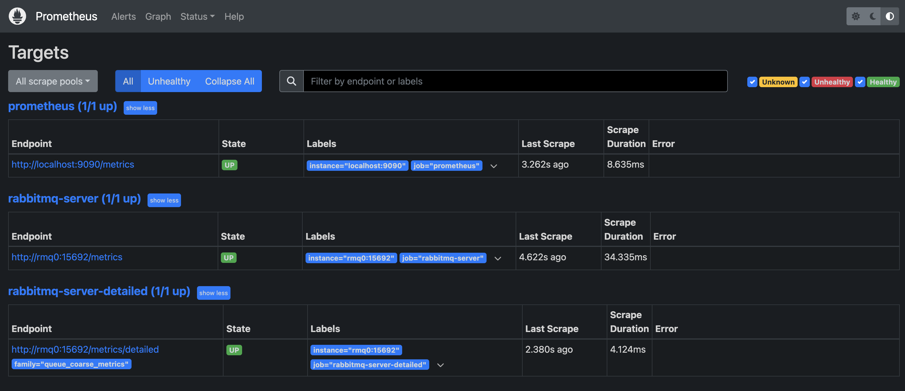

In this guide we will show how to configure our docker-compose to run a monitoring stack for [RabbitMQ](https://www.rabbitmq.com/) with [Prometheus](https://prometheus.io/) and [Grafana](https://grafana.com/).



Project structure:

```
├── compose.yaml
├── grafana
│   └── dashboards
│       └── rabbitmq-overview.json
│   └── dashboards-provisioning
│       └── dashboards.yml
│   └── datasources
│       └── datasources.yml
├── prometheus
│   └── prometheus.yml
├── rabbitmq
│   └── Dockerfile
└── README.md
```

## Requirements

The first thing we need is to have [Docker](https://docs.docker.com/get-docker/) and [Docker Compose](https://docs.docker.com/compose/install/) installed.

## Configuration

### RabbitMQ

To configure RabbitMQ, we are going to create a Dockerfile that allows us to install the [Prometheus](https://www.rabbitmq.com/prometheus.html) plugin and expose port 15692.

```Dockerfile
FROM rabbitmq:3.12.0-management
RUN apt-get update && apt-get install -y wget
RUN rabbitmq-plugins enable rabbitmq_management
EXPOSE 5672 15672
CMD ["rabbitmq-server"]
```

### Prometheus

To configure Prometheus, we will create a `prometheus.yml` file that allows us to configure the RabbitMQ scrape.

```yaml
global:
  scrape_interval: 5s

scrape_configs:
  - job_name: "prometheus"
    scrape_interval: 5s
    static_configs:
      - targets: ["localhost:9090"]

  - job_name: "rabbitmq-server"
    static_configs:
      - targets:
          - "rmq0:15692"

  - job_name: "rabbitmq-server-detailed"
    metrics_path: "/metrics/detailed"
    params:
      family: ["queue_coarse_metrics"]
    static_configs:
      - targets:
          - "rmq0:15692"
```

In the `scrape_configs` settings we are configuring the RabbitMQ scrape on port 15692, which is the internal port that exposes the Prometheus plugin, in its default `/metrics` path.
The static_configs is the list of targets we are going to monitor. In this case, we only have one target which is `rmq0:15692`, which is the name of the RabbitMQ service in the `compose.yaml` file, which has the hostname `rmq0`.

### Grafana

In this case we have to configure our dashboards and datasources. To do this, we will create a folder `grafana` with the following subfolders and files:

- `dashboards`: In this folder we are going to save the dashboards we want to import into Grafana. In this case, we are going to save the `rabbitmq-overview.json` file that contains the RabbitMQ dashboard. You can find it [here](https://grafana.com/grafana/dashboards/10991-rabbitmq-overview/).

- dashboards-provisioning`: In this folder we are going to save the `dashboards.yml` file that allows us to configure the dashboards provisioning in Grafana.

- datasources`: In this folder we will save the `datasources.yml` file that allows us to configure the Prometheus datasource in Grafana.

### Docker Compose

Finally, we are going to create our configuration kernel in the `compose.yaml` file.

```yaml
version: "3"

networks:
  rabbitmq-prometheus:

services:
  prometheus:
    image: prom/prometheus
    container_name: prometheus
    command:
      - "--config.file=/etc/prometheus/prometheus.yml"
    ports:
      - 9090:9090
    networks:
      - "rabbitmq-prometheus"
    restart: unless-stopped
    volumes:
      - ./prometheus:/etc/prometheus
      - prom_data:/prometheus
  grafana:
    image: grafana/grafana
    container_name: grafana
    ports:
      - 3000:3000
    restart: unless-stopped
    networks:
      - "rabbitmq-prometheus"
    environment:
      - GF_SECURITY_ADMIN_USER=admin
      - GF_SECURITY_ADMIN_PASSWORD=grafana
    volumes:
      - ./grafana/datasources:/etc/grafana/provisioning/datasources
      - ./grafana/dashboards-provisioning:/etc/grafana/provisioning/dashboards
      - ./grafana/dashboards:/var/lib/grafana/dashboards
  rabbitmq:
    image: rabbitmq
    container_name: "rabbitmq"
    build:
      context: .
      dockerfile: ./rabbitqm-cluster/Dockerfile
    ports:
      - 15673:15672
      - 15693:15692
    networks:
      - "rabbitmq-prometheus"
    hostname: rabbitmq
    environment:
      RABBITMQ_ERLANG_COOKIE: rabbitmq-prometheus
    volumes:
      - ~/.docker-conf/rabbitmq/data/:/var/lib/rabbitmq/
      - ~/.docker-conf/rabbitmq/log/:/var/log/rabbitmq

volumes:
  prom_data:
```

In this file we are configuring three services:

- `prometheus`: We configure the Prometheus service with the `prometheus.yml` file and port 9090, connected to the `rabbitmq-prometheus` network, we also configure a volume to store Prometheus data.

- Grafana`: We configure the Grafana service with port 3000, connected to the `rabbitmq-prometheus` network, we also tell it the administrator credentials and configure the volumes for the provisioning of dashboards and datasources.

- `rabbitmq`: We configure the RabbitMQ service with the Dockerfile we created earlier, we expose ports 15672 and 15692, connected to the `rabbitmq-prometheus` network, we configure the hostname and volumes for storing RabbitMQ data and logs.

ports 15673 and 15693 are the ports we are going to use to access the RabbitMQ interface and ports 15693 and 15692 are the ports we are going to use for the Prometheus scrape.

## Execution

To run the monitoring stack, we just need to execute the following command:

if you have the docker-compose V1 version:

```bash
docker-compose up -d
```

if you have the docker-compose V2 version:

```bash
docker compose up -d
```

> the `-d` flag is to run in the background. If you don't use it, you will see the logs of the services in the terminal.

Once all the services are running, we can access the different interfaces:

- Prometheus: [http://localhost:9090](http://localhost:9090)
- Grafana: [http://localhost:3000](http://localhost:3000)
- RabbitMQ: [http://localhost:15673](http://localhost:15673)
- RabbitMQ Prometheus Metrics: [http://localhost:15693/metrics](http://localhost:15693/metrics)

## Check if Prometheus is scraping RabbitMQ metrics

To check if Prometheus is scraping the RabbitMQ metrics, go to the Prometheus interface [http://localhost:9090](http://localhost:9090) and now go to the `Status` tab and click on `Targets`.

There we will see that the target `rmq0:15692` is in `UP` status and that the last time it was scraped was a few seconds ago.



## Creating a queue in RabbitMQ

Once we enter the RabbitMQ interface, and log in with the default credentials which are `guest:guest`, we are going to create a queue to see how it is reflected in the Grafana dashboards.

To do this, go to the `Queues` tab and click on `Add a new queue`.
As queue name we are going to put `test_prometheus` and click on `Add queue`.

Now we click on the queue that we have just created or we go to the following link [http://localhost:15673/#/queues/%2F/test_prometheus](http://localhost:15673/#/queues/%2F/test_prometheus) and we will see that the queue is empty.

We are going to send a message to the queue, for it, we click on `Publish message` and in the `Payload` field we put the message that we want to send, for example `Hello World!` and we click on `Publish message`.

## Viewing dashboards in Grafana

Now we go to the Grafana interface [http://localhost:3000](http://localhost:3000) and log in with the credentials we configured in the `compose.yaml` file which are `admin:grafana`.

Once logged in, we go to the `Dashboards` tab.

There we will see that the `RabbitMQ-Overview` dashboard is available, we click on it and we will see the RabbitMQ metrics.

> If you do not see the dashboard, you can import it manually. To do so, click on `new` and then `import` and paste the following code `10991` in the `Find and import dashboards for common applications at grafana.com/dashboards` option

Now we can see that in the RabbitMQ dashboard, in the `Queues` section there is the queue we just created and it has a message in the queue.

## Conclusion

We come to the end of this extensive guide, which has everything you need to set up a monitoring stack for RabbitMQ with Prometheus and Grafana.

If you have any questions, feel free to leave a comment or open an issue in this repository.

- [Repository](https://github.com/ga1az/rabbitmq-prometheus-grafana)
- [Blog](https://ga1az.com/blog/monitoreo-de-rabbit-mq-con-prometheus-y-grafana-usando-docker)
