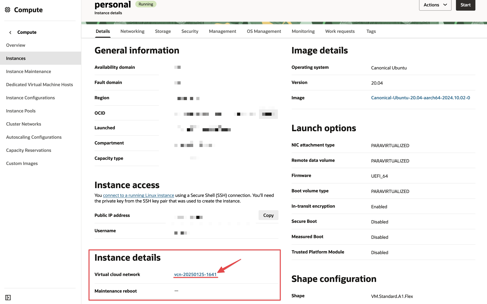

Without a doubt, one of the most challenging tasks when setting up an Oracle Cloud instance is configuring the ports. It can be cumbersome, and it's not always clear how to do it correctly.

> [!NOTE]
> If you are using UFW (Uncomplicated Firewall), you must disable it. It is not recommended to use it in conjunction with Oracle Cloud, as it can cause serious problems.

# Opening Ports on Oracle Cloud Instances (Web Console)

The first step is to go to [Instances](https://cloud.oracle.com/compute/instances) and select the instance you want to configure.

Navigate to the **Instance details** section and click on the **Virtual cloud network** link.



Once inside the VCN, go to the **Security Lists** tab and select your security list. In most cases, this will be the default security list for the VCN.


Now, click on **Add Ingress Rules** to add the security rule for the port you wish to open. In this example, we will open port 8080.


Save the changes, and now you can connect to the instance via SSH to configure its internal firewall.

# Modifying the Instance Firewall

Once you are connected to the instance via SSH, you need to modify its firewall.

```bash
# Add the rule, in this case for port 8080
sudo iptables -A INPUT -p tcp --dport 8080 -j ACCEPT

# Save the changes
sudo sh -c "iptables-save > /etc/iptables/rules.v4"

# Make the rules persistent across reboots
sudo netfilter-persistent save
```

With this, you can now access the instance through port 8080, or any other port you need, by simply changing the port number in the rule as desired. 🚀

References:

- [Enabling Network Traffic to Ubuntu Images in Oracle Cloud Infrastructure](https://blogs.oracle.com/developers/post/enabling-network-traffic-to-ubuntu-images-in-oracle-cloud-infrastructure)