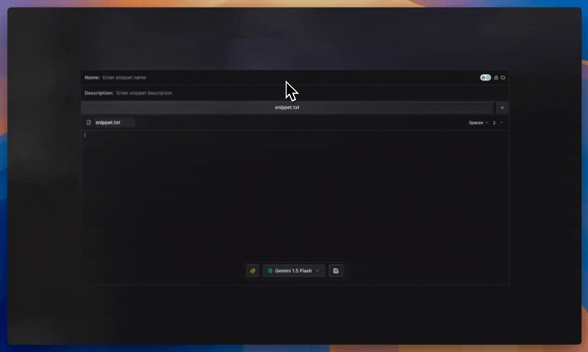

Snippet Manager is the best alternative to GitHub Gist. Keep all your code snippets neatly organized, group them into folders, share snippets with your friends, explore public snippets, and have them reviewed by AI.

>  [Live Demo without AI.](https://editor.ga1az.com/es/login)

## Tech Stack

This application is built with:

- **Next.js**  
- **Elysia**  
- **Drizzle ORM**  
- **PostgreSQL**  
- **Shadcn UI**  
- **AI SDK VERCEL**  
- **BetterAuth**  

The database is structured as a multi-tenant system, partitioning data securely on the backend so each user’s snippets remain isolated.

## Screenshots & GIFs

> Login

> AI improvements

> Folder

